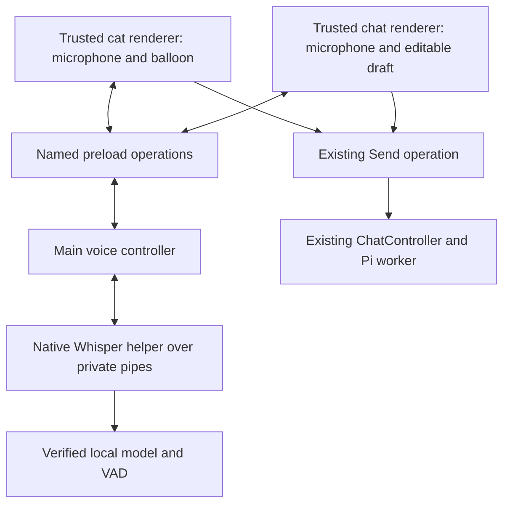

# Local Whisper implementation specification

Reviewed: 2026-09-18. Status: Windows CPU implementation is present. The original design
below describes the intended contracts; [native evidence](native-evidence.md) records actual
builds and measurements. Auto currently selects portable/AVX2 CPU, not CUDA. Live microphone
accuracy and clean-machine release qualification remain outstanding.

Read this specification, the [boundary contracts](contracts.md), and the
[delivery checklist](delivery.md) together. The task-specific
[handoff](../../memory/handoffs/2026-09-17-local-whisper.md) records branch state and verification.
Decision [D009](../../memory/decisions.md#d009-use-local-whisper-for-the-first-speech-input)
supersedes the earlier cloud-first speech-input recommendation.

## Outcome and scope

Add free, local speech-to-text to the existing Windows desktop app. The first complete flow is:

1. Enable voice and explicitly download a supported speech model in Options.
2. Click **Talk** in chat or beside the cat. **Ctrl+Alt+Space** starts or finishes a recording. The initiating window owns the
   microphone; the cat opens a speech bubble without opening chat. Wait for **Listening**.
3. Provisional previews update during recording. **Finish recording** stops the microphone
   and waits for final local recognition.
4. Review/edit that text in the composer or cat balloon and press **Send**, using the currently
   selected demo, Codex, or environment connection exactly as typed input does today.
5. **Cancel recording**, Escape while recording, or the existing global Stop ends capture or
   transcription and discards the unfinished result. Typing stays available after failure.

Editable drafts are the initial product default, not a user request for per-command approvals.
They reuse existing chat behavior and let a user correct recognition errors before a normal
agent turn, whose existing file/shell tools can act on the text. Automatic submission can be
designed later; do not silently add it during this implementation.

This milestone supplies speech input only. Spoken replies, screen capture, accessibility,
mouse/keyboard control, wake words, continuous listening, and general-purpose dictation into
other apps remain separate work. Voice alone gives the cat no new screen context. Keep the
current tool set and Codex authentication unchanged. Do not add a speech API key, hosted
fallback, or subscription-token reuse. Local transcription has no speech-service usage charge;
the selected reasoning connection retains its existing usage limits and costs.

## Engine and model choices

The Computer Cat-owned native helper links whisper.cpp **1.9.4**, frozen at full commit
927cfce34f31707e17f2bff35c349632fb9e2c3a in the
[dependency lock](../../../native/whisper-helper/dependencies.lock.json). The
[release](https://github.com/ggml-org/whisper.cpp/releases/tag/v1.9.4) has no attached native
binaries; the project builds its own helper. Upgrades require deliberate source review.

| Item | Initial selection | Qualification |
| --- | --- | --- |
| Main recognition model | `large-v3-turbo`, unquantized GGML weights | Quality baseline; upstream lists about 1.5 GiB on disk |
| Smaller CPU option | `base.en` | English-only, explicitly selected; upstream lists about 142 MiB |
| Quantization experiment | `large-v3-turbo-q5_0` | About 547 MiB; compare command fidelity before offering/defaulting it |
| Language | English initially; Auto for multilingual Turbo | Never enable translation; reject Auto/non-English with `base.en` |
| Acceleration | Auto: guarded AVX2 CPU, otherwise portable CPU | CUDA is unsupported in this build; no driver/toolkit installation at runtime |
| Voice activity detection | Pinned Silero 6.2.0 GGML artifact | Detect no-speech captures locally before decoding; preserve speech edges |

Sizes are download/storage estimates, not RAM/VRAM requirements. Model names, formats, sizes,
and quantization come from the [versioned model catalogue](https://github.com/ggml-org/whisper.cpp/blob/v1.9.4/models/README.md).
The [Whisper Turbo model card](https://huggingface.co/openai/whisper-large-v3-turbo) identifies
the weights as MIT-licensed. Preserve upstream notices and separately inventory the engine,
VAD, GGML, native JSON library, and redistributed GPU/runtime libraries before packaging.
CPU builds, hashes and single-sample latency are verified in [native evidence](native-evidence.md).
CUDA compatibility and broad accuracy/latency qualification remain unverified.

Do not silently replace a selected model with a smaller one. If Turbo is too slow or cannot
load, explain the failure and offer the smaller download. Backend fallback may keep the same
model. A future GPU implementation must try CPU once after initialization failure and publish
the actual backend,
and remain local. An inference-time failure should return an error and let the user retry;
avoid looping expensive retries while preserving audio indefinitely.

## Process and module structure



Main owns lifecycle, sender validation, download state, model selection, capture sessions, and
helper supervision. The initiating renderer uses browser microphone APIs and emits bounded PCM.
The pet receives its own transcript and can Send reviewed text, but cannot change speech settings. The helper has no microphone, credentials, Pi imports, tool access,
or network server. It receives a model path selected by main and audio over inherited pipes.
Process separation contains inference crashes; it is not an OS security sandbox.

The module map below is the implementation guide. Shared validation currently lives in
voice.ts; no separate voice-validation.ts file is needed. CPU build/staging and offline
fixtures are implemented; CUDA and broader release evaluation remain unsupported/pending.

```text
src/shared/voice.ts                         Serializable settings, states, results, error codes
src/shared/voice-validation.ts              Strict schemas and byte/time/language limits
src/main/voice/controller.ts                Session ownership, transitions, transcript delivery
src/main/voice/permissions.ts               Pure permission policy and Electron adapters
src/main/voice/model-store.ts               Fixed model catalogue, downloads, verify/delete
src/main/voice/settings.ts                  Atomic versioned voice.json storage
src/main/voice/whisper-runtime.ts            Provider-neutral runtime implementation, supervision
src/main/voice/helper-protocol.ts            Bounded native frame encoder/decoder
src/renderer/src/voice/capture.ts            getUserMedia and graph/track cleanup
src/renderer/src/voice/pcm-worklet.ts        Off-main-thread capture, PCM normalization
src/renderer/src/voice/useVoice.ts           Subscriptions, command handling, draft ownership
src/renderer/src/voice/VoiceControls.tsx     Talk, Finish, Cancel, listening status
src/renderer/src/voice/VoiceOptions.tsx      Staged preferences and explicit model operations
native/whisper-helper/CMakeLists.txt        Reproducible native target
native/whisper-helper/src/main.cpp          Framing, inference thread, abort, parent-loss exit
native/whisper-helper/tests/                Protocol/lifecycle tests without real model weights
native/whisper-helper/dependencies.lock.json Full commits, archive hashes, build configuration
resources/voice/models.json                 Reviewed model/VAD revisions, bytes, SHA-256, notices
resources/voice/THIRD_PARTY_NOTICES.md       Notices tied to exact packaged artifacts
scripts/build-whisper-helper.ps1            Hidden/noninteractive Windows build, CPU/CUDA variants
tests/fixtures/voice-helper.mjs              Deterministic native-protocol test double
tests/unit/voice-*.test.ts                   Boundary behavior, lifecycle, storage, conversion
tests/smoke/voice.spec.ts                    Electron UI/permission/cancellation with fake audio
```

Use an app-owned `SpeechRecognizer` interface in the main voice module with asynchronous
`prepare`, `transcribe(pcm, options, signal)`, and `dispose`. Return text and bounded timing/
backend metadata; do not leak native structures or provider-specific types into the renderer.
Construct it with injected filesystem, process, download, and clock dependencies for tests.
Do not put speech code in `src/agent/`: that directory remains Pi-specific.

| Existing source | Required integration |
| --- | --- |
| [Main](../../../src/main/index.ts) | Instantiate controller; wire named IPC/role checks, microphone policy, hide/reload/quit/suspend handling and unified Stop |
| [Contracts](../../../src/shared/contracts.ts) and [preload](../../../src/preload/index.ts) | Add the narrow voice API; preserve subscription cleanup and role-specific snapshots |
| [App](../../../src/renderer/src/App.tsx) | Voice status, capture owner, draft revision guard, pending transcript review, busy controls |
| [Pet](../../../src/renderer/src/Pet.tsx) | Talk command/status, Stop during speech work; retain drag/click behavior and artwork bounds |
| [Options](../../../src/renderer/src/OptionsDialog.tsx) | Voice tab; staged settings with download/delete actions separate from Apply |
| [Chat controller](../../../src/main/chat-controller.ts) | Keep its existing text-only send path; main prevents conflicting voice/history/model transitions |
| [Build](../../../electron.vite.config.ts) | Emit a locally packaged AudioWorklet asset; retain production renderer network restrictions |
| [Packaging](../../../electron-builder.yml) | Native executable, private DLLs, and notices outside ASAR; models outside installer |
| [CI](../../../.github/workflows/ci.yml) and [release](../../../.github/workflows/release.yml) | Build/stage helper before Windows packaging; test real packaged native protocol without GPU/model downloads |

## Capture and normalization

Use `getUserMedia({ audio: ..., video: false })` in the trusted initiating main frame after a
main-issued capture grant. Default to the OS input device; an optional selected microphone
ID may live in local preferences, never shared developer memory. Handle a disappeared device
with an explicit selector/retry instead of changing input devices mid-recording.

Use an AudioWorklet to capture mono samples and produce 16 kHz signed 16-bit little-endian
PCM in bounded chunks. Read the actual AudioContext sample rate; requesting 16 kHz is not a
guarantee. Downmix then use a tested band-limited resampler with state carried across chunks.
Do not relabel 44.1/48/96 kHz samples as 16 kHz or independently resample each chunk with
discontinuous boundaries. Flush the resampler tail once when finishing.

Ship the worklet as a local build asset with a verified packaged URL. Keep graph processing
off the React thread. Use a silent output path if needed to keep the graph processing without
feeding microphone audio to speakers. Check AudioContext resume behavior for pet-origin Talk;
if the platform requires another gesture, present **Start microphone** and do not claim to
be listening. Never buffer speech before a valid capture session.

Start with 250 ms chunks, a maximum of four unacknowledged chunks, and the limits in the
[contracts](contracts.md). Backpressure overflow fails the capture visibly instead of dropping
words or building an unbounded IPC queue. Echo cancellation/noise suppression can be requested,
but device support is not guaranteed. No output speech exists in this milestone.

VAD runs on the completed utterance inside the helper. Keep manual finishing: VAD must not
end recording during a pause. Treat silence/no speech as a typed outcome, leave the draft
unchanged, and display **No speech detected. Try again.** Test keyboard noise and short/quiet
words before selecting thresholds; do not treat amplitude alone as reliable speech detection.

## UX and lifecycle

- Voice is disabled by default. Enabling it does not open the microphone. Download is a
  separate immediate action showing model size/progress/cancel; no background first-run fetch.
- Enabled, installed weights prepare at startup and after settings Apply, without a microphone.
  **Talk** awaits preparation before granting capture. Show **Loading speech model** until
  ready, then **Starting microphone**, then **Listening** only after the graph is producing data.
- Talk from the pet stays in its balloon, with persistent Finish/Cancel and transcript previews.
  Chat-origin recording still shows a pet status indicator when its controls hide. Neither relies on animation.
- Use click-to-start/click-to-finish initially. Do not add a global hold-to-talk shortcut:
  Electron's current shortcut callback is not a key-up stream. Preserve existing shortcuts.
- **Finish recording** closes tracks, flushes final chunks, and starts transcription.
  **Cancel recording** discards; **Stop** and `Ctrl+Shift+Escape` cancel voice and the active
  agent turn. A pending reviewed transcript is a draft and is not erased by Stop.
- Ordinary focus changes may continue a visible recording. Hiding/minimizing the recording owner, opening
  a modal dialog, changing conversation/model, disconnecting, renderer navigation/reload/crash,
  app lock/suspend, or quitting cancels active capture/transcription before proceeding.
- Reject Talk while an agent reply is busy; the user can use the existing Stop first. Reject
  typed Send during capture/transcription at the main boundary as well as in the UI.
- While a session is active, changing speech settings/model assets is blocked except disabling
  voice, which cancels first. Serialize simultaneous IPC transitions to avoid races.
- Reviewed 2026-09-19: keep enabled models resident by default. The Voice performance setting
  can opt into a five-minute idle unload. Disable, lock/suspend and quit release the helper;
  unlock/resume prepares it again. Chat transitions preserve preparation, and cancellation
  without inference retains the loaded model. No microphone stays open to keep a model warm.

Preserve the [XP design](../../windows-xp-design.md): one compact composer, existing status bar,
native-looking buttons, stable pet silhouette, keyboard focus, and minimum 500 by 420 layout.
Voice options show enabled, model, language, microphone, and backend. Preferences use Apply/OK;
Cancel discards staged changes. Download/remove are explicit immediate asset operations and
are labelled accordingly. A failed save retains previous live preferences. Do not partially
apply a multi-tab save without making its result clear; follow the existing property-sheet pattern.

## Transcript ownership and persistence

At recording start, remember the active conversation ID and renderer draft revision. Recognition
never calls the agent. If the conversation/revision still match, append the finished text to the
existing composer with one appropriate separator. If typing changed the draft, keep the transcript
in a small review panel with **Insert** and **Discard**; never overwrite concurrent typing.
Use the session ID to deduplicate deliveries. Keep a result in main only until the initiating renderer
acknowledges safe ownership. See the [contract](contracts.md#result-delivery-and-chat-races).

Recordings, model input, and unsent transcripts are memory-only. Do not create WAV files, dump
raw helper output, log recognition text, or attach audio to native Pi JSONL. Release buffers on
finish/cancel/error; this is application retention behavior, not a promise against OS paging or
crash dumps. Sent text follows existing plaintext conversation retention/deletion behavior.
Show concise copy: **Speech is transcribed on this computer. Sending the text uses your selected
connection.** Do not describe the whole reasoning conversation as offline.

Persist only validated voice preferences and verified model assets beneath app user data.
Keep credentials, text, audio, and device labels out of telemetry and versioned project memory.
Download metadata and diagnostics can record model ID, engine/backend version, byte counts,
durations, and sanitized error codes. Diagnostic collection should not include private payloads.

## Native distribution and first implementation gate

Use a persistent native helper with framed standard-input/output, not a public HTTP service or
an Electron native addon. This keeps the model loaded, avoids an Electron ABI coupling, and
gives main a process it can terminate. Prototype with upstream CLI only to establish artifacts
and baseline performance; a per-recording CLI launch is not the final warm-session architecture.

Build CPU variants against the same frozen upstream source. Future CUDA builds require their
own runtime/license inventory before distribution. Launch with `shell: false`,
an absolute app-owned executable path, `windowsHide: true`, and an allowlisted environment
without credentials. Load private DLLs from the packaged helper directory, not the Desktop or
an uncontrolled working directory. The native process must detect stdin EOF/parent loss; main
also supervises termination. Do not assume a canceled JavaScript promise stops native inference.

The native helper uses one inference thread/context and a separate input reader so a cancel
message can be observed during decoding. The pinned [C API](https://github.com/ggml-org/whisper.cpp/blob/v1.9.4/include/whisper.h)
provides model initialization, raw 16 kHz float input, full transcription and abort callbacks.
Convert validated PCM16 to float at that boundary; retain the context between turns but reset
linguistic context for every utterance. Disable translation, stdout progress/text printing, and
unrequested transcript conditioning. Treat abort callbacks as cooperative; enforce a process
shutdown deadline for a stuck backend. Destroy/recreate after forced termination.

Before expanding the UI, prove the helper starts from an unpacked Windows app without Python,
FFmpeg, a globally installed Whisper executable, a CUDA toolkit, or developer PATH dependencies.
CPU must work on a machine without an NVIDIA GPU. CUDA is an optimization gated on packaged
runtime dependencies and compatible drivers, not a prerequisite for using voice.

Record full commits, artifact hashes, Windows architecture, compiler/CMake/CUDA versions,
build flags, linked runtime dependencies and notices. Model/VAD catalog entries need immutable
upstream revisions, exact byte lengths and SHA-256 values verified from downloaded bytes.
The current upstream model table includes 40-character hashes; do not copy them into a SHA-256
field. Artifact acquisition and CPU native viability have been demonstrated;
[release qualification](../../memory/handoffs/2026-09-17-local-whisper.md) remains open.
