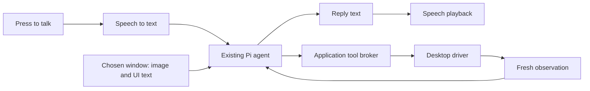

# Voice, screen context, and computer control

Reviewed: 2026-09-17. Status: broad research and proposals; local Whisper speech input was
subsequently selected for implementation preparation. No voice/desktop feature is delivered.
Repository baseline: `dev` at `2acff1b`, with a clean working tree before
this documentation change. Research used current primary documentation and the installed
Pi 0.85.1 declarations. No speech provider or desktop driver was installed, called, or
benchmarked. Vendor capabilities are distinguished below from our proposed behavior.

The user selected free local Whisper after this comparison. The maintained
[Whisper implementation specification](implementation/whisper/README.md) and
[D009](memory/decisions.md#d009-use-local-whisper-for-the-first-speech-input) supersede the
original cloud-first input recommendation and put speech input first in the next build sequence.
Cloud speech output and desktop drivers below remain unselected proposals.

## Recommendation

Keep Electron and Pi. Add a push-to-talk voice pipeline, explicit screen context, and a
replaceable desktop driver. Prove this experience first:

1. Click the cat or press a shortcut while looking at an app.
2. Ask, "What does this error mean?"
3. The cat receives the intended window's screenshot and readable UI context, then speaks a
   short answer while displaying the full answer in chat.
4. Ask it to perform a small task. It observes, acts, checks the result, and reports what happened.

The long-term experience above includes several independent features. The next implementation
is local speech input into an editable chat draft. Sending still uses the selected reasoning
connection. Cloud speech output has not been selected or authorized by that input choice.

| Capability | First implementation to evaluate | Reason |
| --- | --- | --- |
| Hear the user | Local Whisper `large-v3-turbo` through `whisper.cpp` | Selected free input method; native Windows helper, CPU fallback, editable transcripts |
| Speak replies | Compare installed Windows voices, Kokoro and cloud TTS | Separate decision; no speech-output provider selected |
| Understand and plan | Existing Pi runtime with a verified image-capable model | Reuses conversations, model selection, and the agent loop |
| See the current app | Scoped screenshot plus window identity and accessibility text | Supplies visual context and readable controls together |
| Operate apps | Cua Driver behind a Computer Cat-owned adapter | Reuses native inspection and input; test Windows-MCP as the fallback |
| Smaller local input | Explicitly selected `base.en` | English-only CPU option; evaluate accuracy and latency |

These have not been benchmarked in Computer Cat. Local Whisper is the selected input direction;
other rows remain proposals. For comparison, the current OpenAI
[transcription guide](https://developers.openai.com/api/docs/guides/speech-to-text) recommends
`gpt-transcribe` for new general-purpose transcription. The
[TTS guide](https://developers.openai.com/api/docs/guides/text-to-speech) documents streaming
and voice delivery instructions. Pi already accepts image prompts and custom tools in its
[versioned SDK](https://github.com/earendil-works/pi/blob/v0.85.1/packages/coding-agent/docs/sdk.md).

## Whisper and Wispr are different

**Whisper** recognizes speech. It does not supply the cat's speaking voice, understand a
screenshot, or move the mouse. The hosted `whisper-1` model is a cloud API; the open-source
model can instead run locally through `whisper.cpp`. The latter supports Windows, CPU
inference, quantization, and several GPU backends. Benchmark a small English or multilingual
model on the target laptop; choose model size from measured accuracy and response time.
Keep the model loaded while voice is enabled, and use a supervised helper so inference cannot
freeze Electron. Model downloads and a packaged native runtime add installer work.
[Whisper model](https://developers.openai.com/api/docs/models/whisper-1),
[whisper.cpp](https://github.com/ggml-org/whisper.cpp).

**Wispr Flow** is a different dictation product. Its official API provides WebSocket and REST
transcription with editing behavior such as removing filler and applying spoken corrections.
That is useful for dictation, but command fidelity needs evaluation: negations, file names,
numbers, and "actually, don't do that" must survive processing. Its quickstart currently says
API access requires organization approval. Billing details are contractual; the public billing
page does not establish a simple rate for this project. Keep it as an optional candidate if
access is obtained, rather than a launch dependency.
[Wispr API](https://api-docs.wisprflow.ai/introduction),
[access requirements](https://api-docs.wisprflow.ai/quickstart),
[billing](https://api-docs.wisprflow.ai/usage_billing).

## Voice architecture and alternatives

Start with separate recognition, agent, and synthesis stages:

Computer Cat remains the owner of each turn and action. A chained pipeline adds stage latency,
but lets us preserve an inspectable transcript and replace speech providers independently of
the reasoning model. This is a fit judgment based on the existing app, consistent with the
[voice architecture guidance](https://developers.openai.com/api/docs/guides/voice-agents).

| Option | Where it fits | Tradeoff to evaluate |
| --- | --- | --- |
| OpenAI transcription and TTS | Optional future cloud speech pipeline | Network and metered API usage; existing Codex sign-in is a separate connection |
| `whisper.cpp` | Selected local recognition implementation | CPU/GPU load, cold start, model size, microphone/noise accuracy remain test gates |
| Installed Windows voices | Simple local speaking fallback | Voice availability and character vary by installation; use a narrow native adapter |
| Kokoro-82M | Local neural voice candidate | Open weights; test runtime, pronunciation, warm-up, and packaged dependencies |
| ElevenLabs | Audition for a distinctive cat voice | Compare expressive conversational and Flash voices on the same lines; separate provider |
| Cartesia Sonic 3.6 | Another streaming voice candidate | Compare pronunciation, timing, and voice identity; separate provider |
| Wispr Flow | Optional recognition/dictation adapter | Approval-gated API and text-editing semantics |

Windows exposes installed synthesis voices through
[SpeechSynthesizer](https://learn.microsoft.com/en-us/uwp/api/windows.media.speechsynthesis.speechsynthesizer?view=winrt-26100).
[Kokoro's model card](https://huggingface.co/hexgrad/Kokoro-82M) lists 82 million parameters and
Apache-2.0 weights; check the runtime, phonemizer, and voice assets separately before packaging.
[ElevenLabs](https://elevenlabs.io/docs/overview/models) lists both expressive conversational
and low-latency Flash models; its advertised inference times exclude application/network
latency. [Cartesia](https://docs.cartesia.ai/build-with-cartesia/tts-models/latest) currently
documents Sonic 3.6 and dated snapshots. No listening comparison was performed here.

Piper is another local engine, but the maintained
[Piper repository](https://github.com/OHF-Voice/piper1-gpl) is GPL-3.0 and voice assets need
their own review. Do not assume older MIT Piper examples describe the current distribution.
This note records package metadata, not a determination of distribution obligations.

For the cat's personality, audition a handful of licensed stock voices with our actual short
answers. Keep its spoken responses concise; leave tables, code, and long explanations in chat.
Generate speech from completed, speakable sentences rather than every token. Cancel queued
audio on Stop or a new voice turn. Drive a subtle speaking animation from playback amplitude;
phoneme-level lip sync is unnecessary for the current pixel cat. Cache only generic local cues,
such as the listening sound, rather than private replies. The OpenAI TTS guide also requires
clear disclosure that the generated voice is AI-generated.

For a later conversational mode, evaluate **GPT-Live with client delegation**. Current official
docs describe a voice frontend that can listen while speaking and delegate work to an existing
agent. This is a promising fit for Pi when users need to interrupt or add details during work.
The Realtime API is another option that combines speech, reasoning, and tool selection in one
model session. Neither is necessary for the requested click-and-ask first milestone.
Interrupting spoken audio does not by itself stop the backend task; Computer Cat must wire
that explicitly. [GPT-Live](https://developers.openai.com/api/docs/guides/live).

## Screen context: what the cat should receive

A proposed observation should contain an opaque observation ID, timestamp, intended window
identity, image dimensions, coordinate metadata, screenshot, and a bounded amount of relevant
UI text. Label capture failure, truncated accessibility data, and unsupported surfaces explicitly.
Prefer the current window, with a region/display picker when the user needs something else.

Resolve the target **before the cat UI takes focus**. A shortcut can capture the external
foreground window before opening chat. For a cat click, retain the last external foreground
window identity transiently and show the selected target. If that identity is ambiguous or
gone, let the user choose a window. Tracking window identity need not continuously capture
screenshots or audio. Do not accidentally answer questions about Computer Cat's own window.

There are three complementary sources of context:

| Source | Useful for | Boundary |
| --- | --- | --- |
| Screenshot and optional cropped detail | Layout, images, charts, canvas apps, visual errors | Only captured pixels; small text and protected surfaces can fail |
| Windows accessibility/UI Automation | Control names, values, roles, and actionable identities | Coverage depends on each application's accessibility implementation |
| Browser DOM or application/service API | Structured page/document information and precise operations | Requires a supported connection and explicit target scope |

Electron's main-process
[desktopCapturer](https://www.electronjs.org/docs/latest/api/desktop-capturer) can enumerate
window/display sources for an initial screenshot feature. Its default thumbnails are tiny;
request suitable resolution and inspect the actual returned size. The
[source contract](https://www.electronjs.org/docs/latest/api/structures/desktop-capturer-source)
does not guarantee the requested thumbnail size. It supplies no native accessibility tree or
mouse-control layer. Use the desktop driver for those capabilities.

For action coordinates, use the image and coordinate contract from the **same driver**.
Do not feed coordinates from an Electron thumbnail or resized model image directly into
native input. Carry crop, scale, window origin, and display information explicitly. Prefer
fresh element identities where possible. Reading a window on a second monitor and operating
the whole secondary desktop are different capabilities and require separate tests.

"Anything on the computer" should expand in stages: visible window first, explicitly selected
open apps next, then requested files or connected services. A screenshot cannot reveal an
entire hidden document or every browser tab. Existing Pi file tools can supply file context
when the task calls for it. Continuous screen history is a separate product decision; if added,
use a visible mode, app exclusions, change-triggered capture, and bounded retention.

## Desktop driver recommendation

Evaluate **Cua Driver first**, behind our own small `DesktopDriver` contract. It documents
Windows UI Automation, screenshots, native input, and browser operations. This is a local
host-desktop component; a cloud desktop would not automatically contain the user's open apps.
[Platform support](https://cua.ai/docs/reference/cua-driver/platform-support).

The earlier [research plan](research-and-build-plan.md) proposed MCP first. Current Cua
[integration guidance](https://cua.ai/docs/concepts/choose-a-cua-driver-integration) distinguishes
existing harnesses using MCP from applications embedding its SDK. For Computer Cat, evaluate
the TypeScript SDK in a supervised private helper, exposed through Pi custom tools. This can
avoid making a general-purpose MCP bridge a prerequisite for the first desktop feature.
Retain local stdio MCP as the fallback if its released packaging is simpler or more reliable;
use the official MCP client when that route is selected. This refines the proposal, not an
implemented architecture decision.

There is a concrete version gate: the
[SDK guide](https://cua.ai/docs/how-to-guides/driver/use-sdk-in-process) marks some typed native
window examples as targeting a breaking release and says 0.25 uses the generic tool surface.
Resolve an actual release and inspect its declarations before implementation. Pin bindings
and native binaries together; prove installer behavior and shutdown on a clean Windows account.
Do not copy an unreleased example or choose a mutable nightly as the release dependency.

Start with a bounded surface: list/select windows, observe a window, click a known element or
point, enter text, press keys, and scroll. Add drag only when required. Our broker should bind
every action to a task and exact target, serialize input, and verify the postcondition from a
fresh observation. After an uncertain action result, inspect before retrying; repeated clicks
or typing can duplicate a successful action whose acknowledgment was lost.

Cua's [Windows tool reference](https://cua.ai/docs/reference/cua-driver/mcp-tools-windows)
distinguishes window-local screenshot coordinates, stale snapshot identities, and desktop
coordinates. It names `display_id="primary"` as the portable desktop target, so arbitrary
multi-display desktop control remains a release-specific test gate. Its
[known limits](https://cua.ai/docs/reference/cua-driver/limits) also qualify browser and
background support. Existing signed-in browser attachment needs its own setup; installing a
driver does not automatically provide DOM access to every existing tab. Do not promise users
that all actions can happen in the background while they continue using the same input devices.

Compare [Windows-MCP](https://github.com/CursorTouch/Windows-MCP) on failing or required tasks.
It offers UI snapshots, screenshots, input, and browser-oriented extraction, but adds Python
3.13+ packaging. Expose only the required tools; its broader shell/process/registry surface
is not needed just to inspect or operate a window. Raw mouse libraries would supply input
primitives while leaving observation, UI semantics, targeting, and verification for us to build.

Windows itself limits some operations: ordinary `SendInput` cannot inject into a higher
integrity application. Secure desktops and protected content should produce an honest
unsupported result. Do not default to running the entire app as administrator.
[Microsoft input restrictions](https://learn.microsoft.com/en-us/windows/win32/api/winuser/nf-winuser-sendinput).

## Concrete changes required in this repository

The following are code observations, not results of a new test run:

| Current boundary | Required extension |
| --- | --- |
| [AgentRuntime](../src/agent/runtime.ts) accepts a string | Structured turn input with bounded image/context attachments, keeping SDK types inside `src/agent` |
| [Worker protocol](../src/agent/protocol.ts) carries text and built-in tool activity | Validated observation attachments and task-correlated broker requests/results; reject stale responses |
| [Pi adapter](../src/agent/pi-runtime.ts) calls `session.prompt` without images | Map attachments into Pi image content and register explicit custom desktop tools |
| [Tool contract](../src/shared/tools.ts) enumerates eight Pi tools | Add product-owned desktop activity names and distinguish attempted from verified actions |
| [Main](../src/main/index.ts) rejects all browser permission requests/checks | Narrow, user-initiated microphone permission for the trusted audio surface; retain other denials |
| [Build CSP](../electron.vite.config.ts) blocks renderer network access | Keep provider requests privileged; deliberately allow only the local audio playback mechanism needed |
| [Preload](../src/preload/index.ts) exposes named operations | Add bounded start/stop voice, observe-target, and playback operations; no generic IPC or credentials |
| Native Pi sessions persist tool content | Define image/audio retention before adding them; verify both transcript and Pi JSONL storage |

Use standard microphone capture in a trusted, explicitly enabled media surface; no Node or
credentials in the renderer. Main owns speech credentials and turn state; supervised workers
own blocking inference/desktop work. Provider-neutral speech interfaces should accept an
AbortSignal and report typed status/errors. Microphone failure leaves typed chat usable.

The current Pi session stores native messages and tool results, as covered by
[Pi runtime tests](../tests/unit/pi-runtime.test.ts). Merely keeping screenshot bytes out of
the visible chat does not prevent persistence in native JSONL. Propose ephemeral visual
context by default, but verify an SDK-compatible mechanism before claiming it: a transient
session or a supported persistence filter may be needed. Until then, image retention is an
unresolved implementation gate, not a privacy guarantee.

Separate "ask about this" from "perform this task" authorization. Enforce scope, permitted
operations, and consequential confirmations in the broker. Treat screen/page/document text
as task data, not new authority. Do not ask before each ordinary click in an authorized task.
For an email draft, for example, drafting and pressing Send should be distinct actions.

The current app deliberately exposes unrestricted user-level Bash/PowerShell tools. A new
desktop broker cannot make the whole agent read-only while those tools remain reachable.
If we advertise enforced observation-only or app-limited modes, those turns need a restricted
tool set and review of other escape routes. This research does not remove existing tools.
Worker separation is crash isolation, not an OS sandbox.

Stop must revoke the task's action lease, clear pending input, cancel speech generation and
playback, stop recording, and abort the Pi turn. A hung helper needs a bounded shutdown path.
Extend the existing `Ctrl+Shift+Escape` behavior so stopping the voice cannot leave a desktop
task running. Never equate a cheerful spoken "Done" with a verified app change.

## Cost and credentials

Prices below were checked on 2026-09-17 in official model documentation. They exclude reasoning,
image processing, retries, and taxes, and are not a total per-task estimate.

| Component | Published rate |
| --- | --- |
| [GPT-Transcribe](https://developers.openai.com/api/docs/models/gpt-transcribe) | $0.0045 per input audio minute |
| [GPT-4o Mini TTS](https://developers.openai.com/api/docs/models/gpt-4o-mini-tts) | $0.60 per million input text tokens and $12 per million output audio tokens |
| [Hosted Whisper](https://developers.openai.com/api/docs/models/whisper-1) | $0.006 per input audio minute |

For illustration, 10 minutes of user speech daily for 30 days costs $1.35 for GPT-Transcribe
alone: `10 × 30 × $0.0045`. Measure TTS output token usage rather than treating its rate as a
fixed price per wall-clock conversation minute. Local speech has no per-request cloud speech
charge but still uses storage, compute, and power. Continuous capture and repeated screenshots
can materially change the reasoning bill; track cost per completed task.

Treat speech API credentials and billing as separate from the existing Codex OAuth connection.
Do not repurpose its access token as a general speech API key or promise voice API usage is
included. Official [authentication documentation](https://learn.chatgpt.com/docs/auth)
distinguishes subscription access from Platform API billing. For personal development, an
explicit user-supplied speech key can use OS-encrypted storage. A distributed paid service
needs an authenticated backend and usage limits; never bundle a shared vendor secret in the
installer. No automatic switch to a paid provider after an error.

## Build order and decision gates

| Stage | Deliverable | Acceptance gate |
| --- | --- | --- |
| 1. Local speech input | Whisper capture, editable transcript, normal Send and unified Stop | Follow the detailed [delivery checklist](implementation/whisper/delivery.md); packaged native inference and bounded cancellation |
| 2. Ask about a window | Explicit snapshot, readable context, and text answer | Correct pre-cat target; image-capable model; retention and unsupported surfaces handled |
| 3. Add spoken replies | Select synthesis, playback, volume/mute/Stop | Voice quality, cancellation, retention, and echo tested; funding/provider decided separately |
| 4. Do a desktop task | Small desktop tool set through Cua or fallback | Real outcome verified; wrong/stale target rejected; Stop prevents further input |
| 5. Refine daily use | Measured latency, resource use, and costs | Clean-machine packaging, sleep/resume, multi-display/DPI behavior acceptable |
| 6. Natural conversation | Evaluate GPT-Live/client delegation or Realtime | Corrections while work runs, audible interruptions, and backend cancellation stay consistent |

Do not require always-listening, wake words, whole-computer indexing, or a general MCP marketplace
to finish the first useful experience. Screen context and voice are independent enough that
the first two stages can share interfaces without waiting for broad desktop automation.

Before choosing the final stack, use a small repeatable evaluation set: explain a dialog;
read a chart with small text; type and verify a note; operate Calculator; fill a local browser
form without submitting it; save into a disposable test directory. Repeat across the actual
target apps, 100/125/150/200 percent scaling, a second monitor, moved windows, and unavailable
accessibility data. Include exact filenames, numbers, corrections, noise, and silence in voice
fixtures. Test with speakers as well as headphones so the cat does not transcribe itself.

Record median and tail time from release-to-transcript and release-to-first-useful-audio,
task completion, wrong-target actions, interruption recovery, cost, and CPU/RAM. A short
"I'm checking" acknowledgment is not a useful-answer latency measurement. A proposed early
target is under three seconds to a useful spoken answer for a simple cached-context question,
with correct Stop behavior on every run; this is a target, not a measured claim.

Automated tests should use fake audio, synthetic screenshots/UI trees, mocked providers and
drivers, and a controllable test app. Keep paid evaluations explicit and outside CI. Run
`npm run verify` and `npm run test:smoke` for implementation changes. This documentation change
requires `npm run memory:check`; it does not establish application or driver test results.
